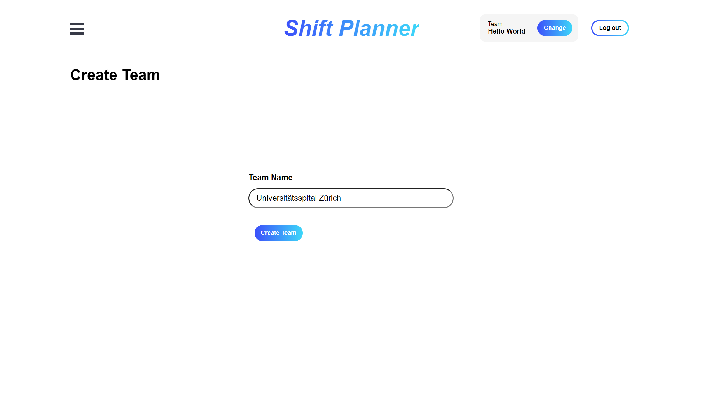
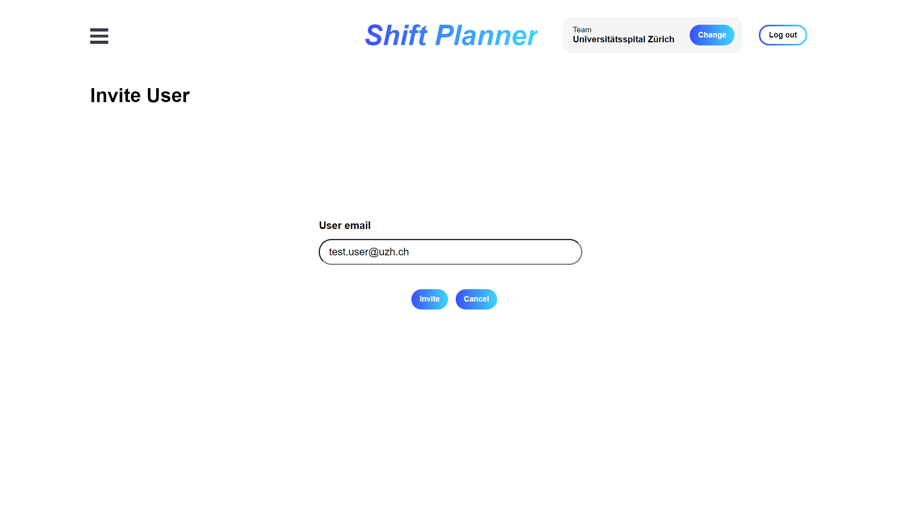
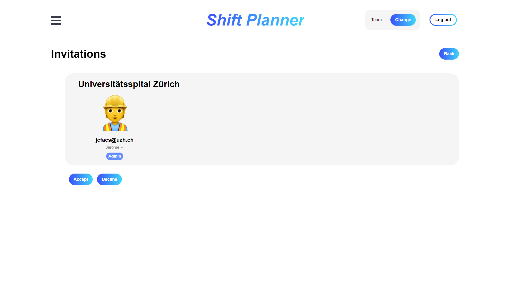
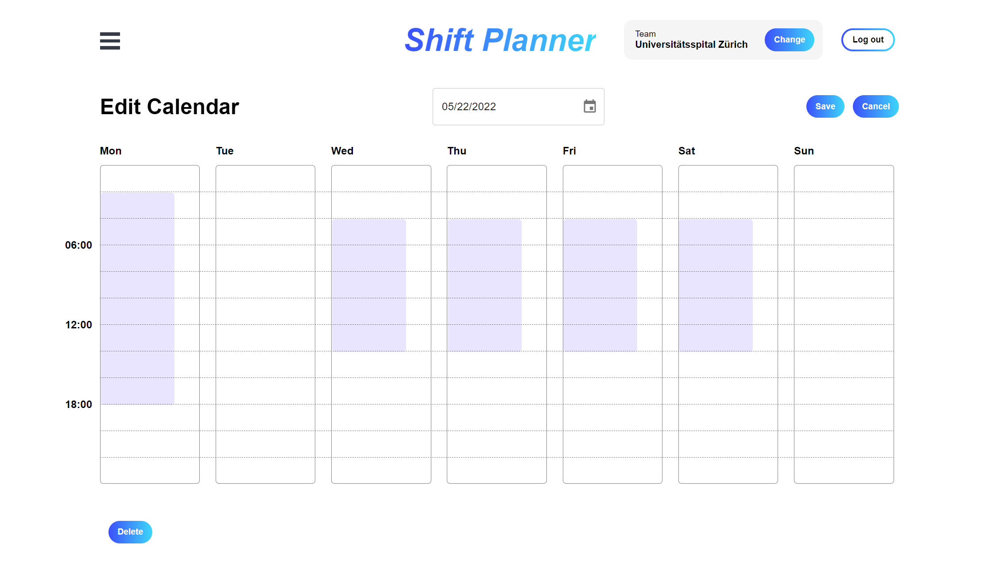
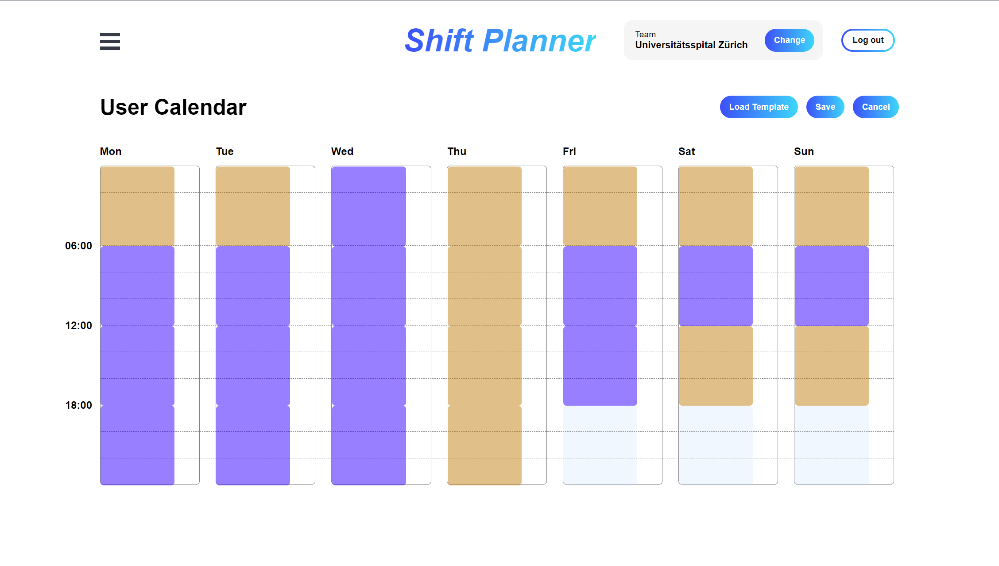
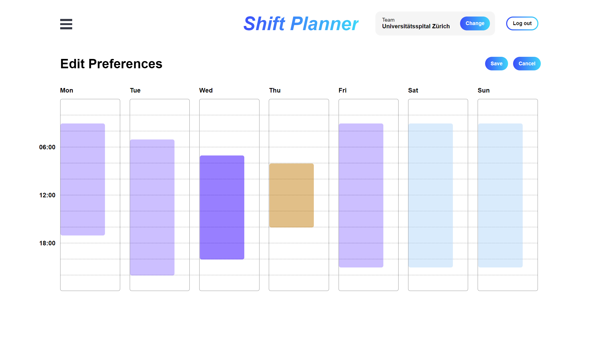
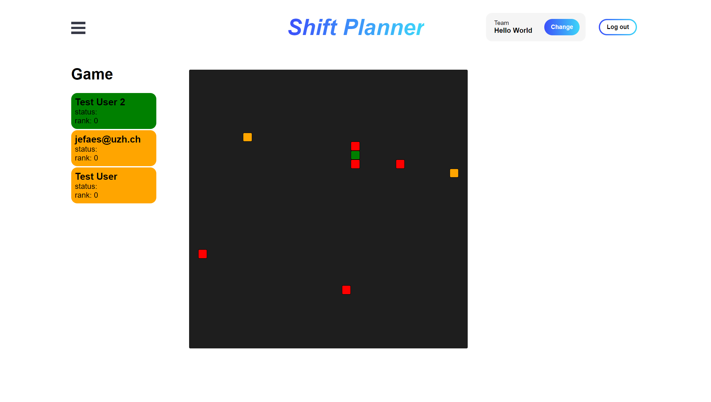

# shift planner SoPra FS22 Group 33

## Introduction
Many teams who are working in shifts are still using hand made plans to organize their work. This takes a lot of time for the team leader, who has to create the plan. The team members have to check the physical plan for changes on a regular basis. The goal of this project is to provide a software system which supports this process. A team leader can create a base plan where the team members get assigned automatically. Team members get their working plan directly into their calendars, and they can post their prefered shifts directly into the system. In case of a conflict, the team members can sort it
out in real time.

## Technologies
- Java 15 
- Gradle
- Spring Boot
- Sonarqube 
- Heroku
- Sendgrid e-mail API 
- optimizer lpsolve 

## High-level components
Component #1: Calendar (src/components/ui/calendar)
The application revolves around team calendars, which have entries (called slots) that are associated to users.

Component #2: Game (src/components/views/Game.js)
The game is used to resolve conflicts arising from the calendar assignment.

Component #3: Game Lobby (src/components/views/GameLobby.js)
The game lobby allows the users to assemble before starting a game session to resolve conflicts.


## Launch & Deployment
The client repository requires ```npm install``` and  ```npm run dev``` to run. There are no further operations needed.


## Illustrations
**Create a group**

Users can create new groups for their operation and automatically become the admin of the group


**Invite users to group**

Enter an email of an existing user to add him to a team


**Accept invitation**

Accept the invitation as the recipient of the invite


**Set up shifts for a group as an admin**

Enter time slots on which people are required to show up and work


**Specify base preferences as a user**

Enter the base working hour preferences as a user which should be applied across all groups


**Specify preferences as a member of a group**

If needed adjust the preferences for specific shifts within a group as a user


**Play game**

Play a game of snake with other members of the same team to resolve conflicts in shifts



## Roadmap
- [ ] automated finalizing of calendars
- [ ] shift swaps
- [ ] individual constraints for team members (working hours per week, number of jokers etc.) 
- [ ] export calendar as .ics


## Authors and acknowledgement
shift planner is created by vmjulia, UpstairsForest, eoeaee and grueezi

thanks to maettuu for guiding us through the semester. 

thanks to the SoPra team for your support and providing a cool course! 

## License
GNU GENERAL PUBLIC LICENSE Version 3 or later


